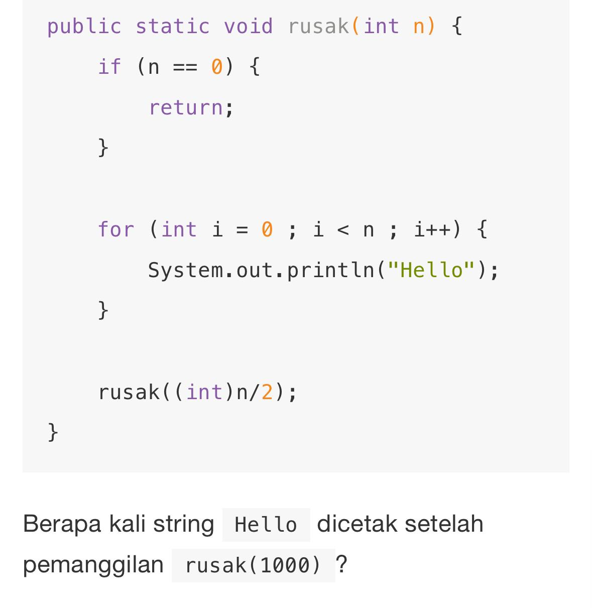
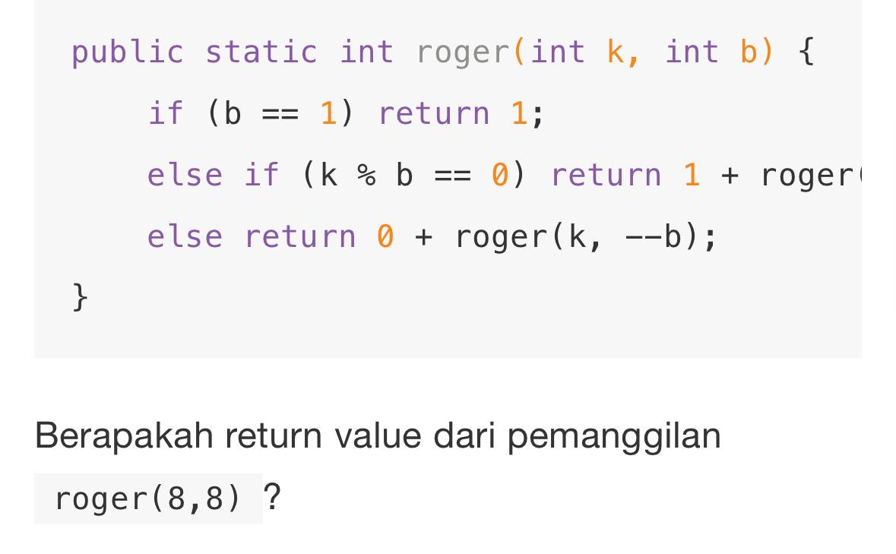
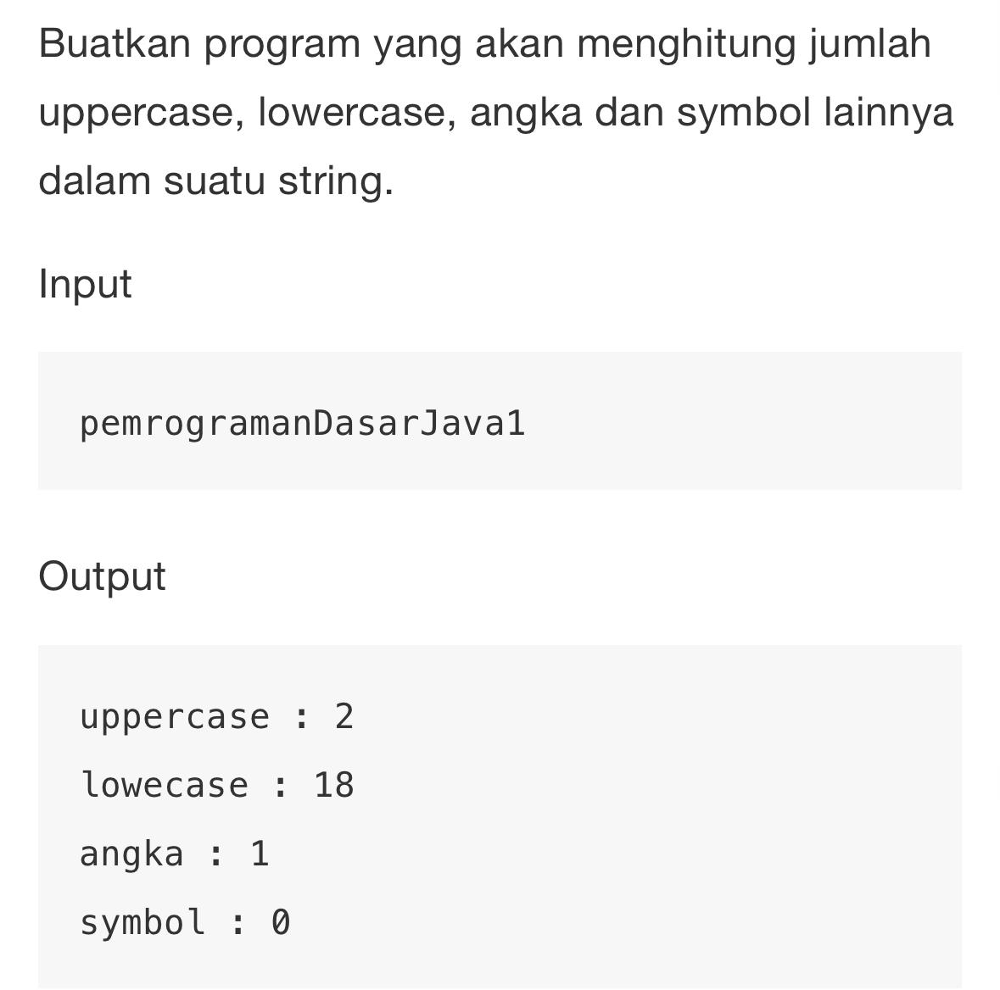

<br />
<p align="center">

<h2 align="center">SHA Test</h2>

  <p align="center">
    Task and Answer
    <br />
  </p>
</p>

### Task

```text
    Hello akan dicetak sebanyak 1994 kali
```



```text
    Nilai return dari fungsi tersebut adalah 4
```


``` java
    public static void countLetter(String text) {
        int countUpperCase = 0;
        int countLowerCase = 0;
        int countSymbol = 0;
        int countNumber = 0;

        // Clean the text from spaces and split into array
        String[] cleanedText = text.replaceAll("\\s", "").split("");

        for (String word : cleanedText) {
            if (UPPERCASE.contains(word)) {
                countUpperCase++;
            } else if (LOWERCASE.contains(word)) {
                countLowerCase++;
            } else if (SYMBOL.contains(word)) {
                countSymbol++;
            } else if (NUMBER.contains(word)) {
                countNumber++;
            }
        }

        System.out.println("uppercase: " + countUpperCase +
                "\nlowercase: " + countLowerCase +
                "\nangka: " + countNumber +
                "\nsymbol: " + countSymbol);
    }
```
```text
    terdapat pada file LetterCounter.java
```


<!-- CONTACT -->

## Contact

M Maulana Z Aditya - Instagram - [@maulanadityaa](https://instagram.com/maulanadityaa)

Project Link: [https://github.com/maulanadityaa/sha-test](https://github.com/maulanadityaa/sha-test)
